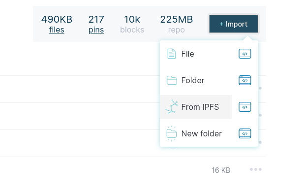
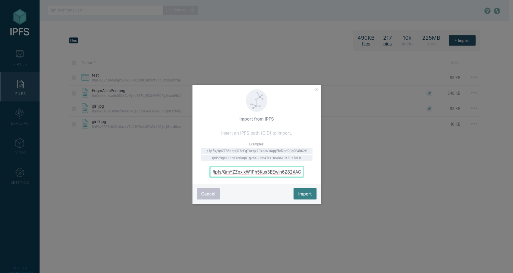

# Beginner

This blog is based on [IPFS](https://en.wikipedia.org/wiki/InterPlanetary_File_System), which makes it possible to host files or data in a decentralized way, similar to torrent. If you want to help the rebels, you can contribute by hosting the necesarry files for this blog from your computer.

First of all you need to install IPFS. The official documentation for installing IPFS on your desktop computer is [here](https://docs.ipfs.io/install/ipfs-desktop/). This documentation will redirect you to [this](https://github.com/ipfs/ipfs-desktop/releases) site, where (if you are using Windows) you should look for a line that is similar to `IPFS-Desktop-Setup-0.14.0.exe`.  Install the newest stable version.

The above step is done, when you reach an interface that looks similar to this:

After this you have two options: you can host the newest blog, or only the current version. If you choose to host always the newest blog, you will have to download a program that is periodically downloading the new articles to your computer.

## Downloading the updater program

If you want your computer to always host the newest version, then you need to download an application (Windows not ready yet, [Linux](ipfs-blog-daemon)) and this program needs to start every time at startup. If you don't know how to run a program automatically at startup, here are some articles: [Windows10](https://www.howtogeek.com/228467/how-to-make-a-program-run-at-startup-on-any-computer/), [Windows7](https://www.groovypost.com/howto/windows-7-make-programs-run-automatically-during-startup/). The IPFS Desktop itself also needs to start every time at startup.

## Only copy the current state

(If you've choosen the above option, you don't need to do this) In the IPFS Desktop application choose the 'Files' menu and click on 'Import'. Choose the 'From IPFS' option. 

You need to add the CID for the _Site_, the _DB_ and the _articles folder_. The current CIDs are listed in the CIDs menu of this website. The QR codes contain the same information, they are mainly there for [IPFS Lite](https://play.google.com/store/apps/details?id=threads.server), you can copy the values with QR code if it's more comfortable for you. IPFS Lite is also available in F-Droid.

If you want to read more, go to the article that was written to advanced users.